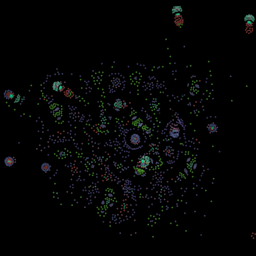

# Particle Life 

In this experiment, nonlinear particle interactions (repulsion and attraction) lead to emergent behaviors that resemble life.

Here, our implementation is simple and not GPU acclerated. As a result, only about 2,000 particles can be processed without lag.



## Controls

- WASD or drag to pan camera 
- scroll to zoom camera in and out
- Press space to explode particles away from your cursor

## Development

```bash
npm install # install dependencies
npm run dev # run development server
```

Interactions are randomized, but can be modified in `/src/engine/config.ts` 

