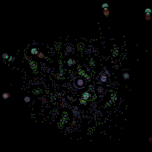

# Particle Life

In this experiment, numerous nonlinear particle interactions (repulsion and attraction)
lead to emergent behaviors that seemingly resemble life.

Here, our implementation is simple and not GPU accelerated. As a result, only a
few thousand particles can be simulated without lag, even with optimizations.



## Controls

- WASD or drag to pan camera
- scroll to zoom camera in and out
- Press space to explode particles away from your cursor

## Development

```bash
pnpm install # install dependencies
pnpm run dev # run development server
```

Interactions are randomized, but the ranges can be modified in `/src/engine/config.ts`
